# Amazon Rekognitionによるストリーミング動画分析
Amazon Rekognitionによるストリーミング動画分析を行うために、以下のシステム構成で実装した  

| サービス名 | 内容 | 
|:-----------|------------|
| Cloud9 | 統合開発環境のサービスであり、本システムでは、Kinesis Video Streamsへの動画データを転送するためのDockerコンテナを実行する環境として利用する |
| Kinesis Video Streams | AWS によるストリーミング動画分析・再生のためのサービスです。 |
| Rekognition | 画像認識AIに特化したサービスです | 
| Kinesis Data Streams | 大量のストリームデータをリアルタイムで収集するための サーバーレスストリーミングデータサービス | 
| S3 | 顔検出に使用する顔画像のデータセットの格納に利用 |

### システム構成

本システムでは、以下のような処理フローとなっている  
1. Cloud9上にAWSから提供しているKinesis Video Streamsへの動画データの転送のプラグインを含めたDockerコンテナを起動し、動画ファイルを加工し、動画データをKinesis Video Streamsへ転送
2. RekognitionからKinesis Video Streams上の動画データを参照し、S3バケット上に保存している検知対象の顔データが存在しているか解析を行う  
3. Rekognitionからの解析結果をKinesis Data Streamsへ転送する  
4. 解析結果をLambdaを経由してOpenSearchにて可視化する  

## 環境構築手順

## 各詳細資料へのリンク
本システムの各AWSリソース上での設定や詳細内容を各資料にまとめているので、詳細が気になる方は以下を参照してください。  

